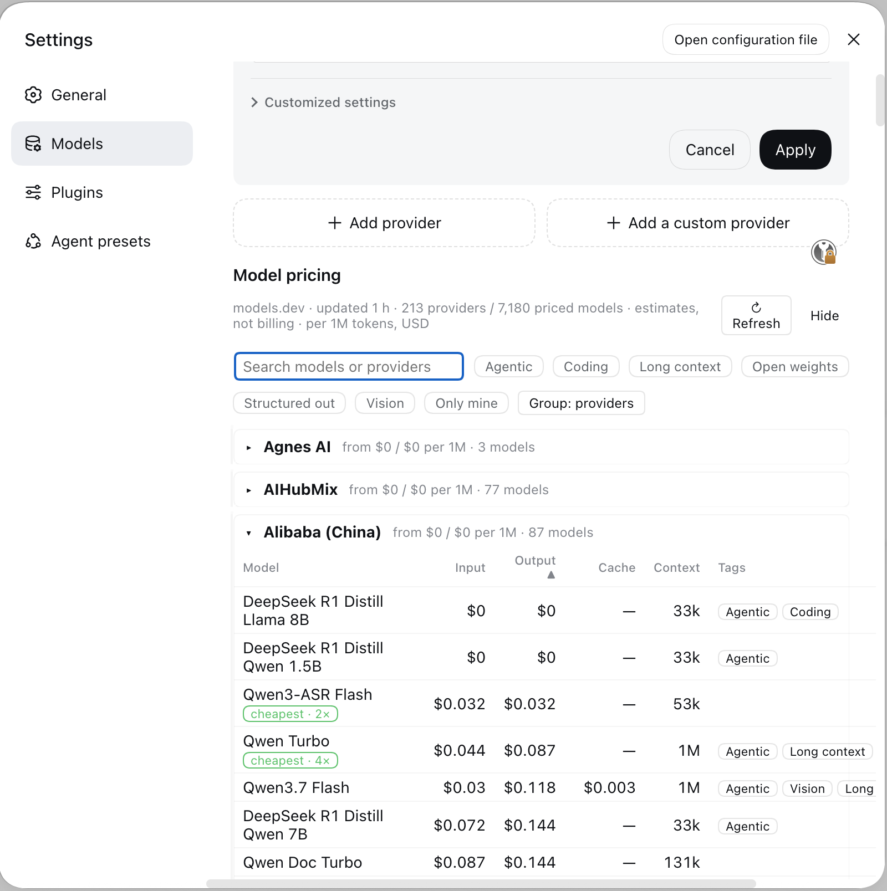

# dsh-model-pricing

**Compare LLM API prices before you pick a model.** A plugin for
[DeepSeek Harness](https://github.com/deepseek-ai/deepseek-harness) (DSH) that puts a
**model pricing and capability table** directly into your DSH settings: per-1M-token
input/output/cache prices, context window, coding/agentic/vision/long-context tags,
and which reachable route is cheapest for the same model right now.

[](https://www.npmjs.com/package/dsh-model-pricing)
[](LICENSE)
[](https://github.com/vitas/dsh-model-pricing)
[](https://github.com/deepseek-ai/deepseek-harness)



*The pricing table in the DSH **Settings → Models** page: cross-provider `cheapest`
badges, capability tags, and per-1M-token prices.*

## Why

Choosing a coding agent model today means opening three browser tabs: your provider's
price page, a comparison site, and someone's spreadsheet of which API is discounting
this month. `dsh-model-pricing` collapses that into the harness you are already in:
one table, filtered to what you can actually call, refreshed from public catalogs on
your own machine.

## Features

- **Pricing table** for every connectable model — input / output / cache-read price
  per 1M tokens, context window, and max output (213 providers, ~7,200 priced models)
- **Capability tags** computed from structured catalog fields: Coding, Agentic,
  Vision, Long context, Open weights, Structured output — with user-configurable rules
- **Authoritative routing prices**: for models DSH can actually invoke, the harness's
  own bundled `pi-ai` catalog overrides the public catalog, and price divergences
  larger than 10% are flagged row by row
- **Automatic cross-provider comparison** for the same model (`−N% vs …`, `cheapest`)
- **Community promotion feed**: verified, time-boxed offers rendered as badges with
  provenance tooltips and a one-click filter; contributed through reviewed pull
  requests and validated by CI (`promos/README.md`)
- Planned next: badges inside provider cards, a `/pricing` command, and
  approximate per-session cost

## Install

```sh
dsh plugin --profile web add dsh-model-pricing
```

Restart `dsh web` and open **Settings → Models**: the pricing table appears at the
bottom of the page. The plugin needs no configuration; first load fetches the
catalog and caches it locally.

From source (for development):

```sh
git clone https://github.com/vitas/dsh-model-pricing.git
cd dsh-model-pricing
npm install && npm run snapshot && npm run build
dsh plugin --profile web add .
```

## Privacy and data sources

The plugin runs entirely on your machine; it operates no server of its own. Its
outbound traffic is an anonymous read of public catalog data:

- [`models.dev`](https://models.dev) — 213 providers with per-model costs and
  capability metadata
- the `@earendil-works/pi-ai` model catalog already bundled with DSH — authoritative
  for the routes you can invoke
- the promotion feed served as static JSON from this repository

Every displayed price is labeled with its source and freshness. Prices are estimates
for model selection, not billing data — your provider's invoice is the only authority.

## Documentation

| Document | Contents |
|----------|----------|
| [docs/feature-map.md](docs/feature-map.md) | Feature specification: scenarios, epics, MVP definition of done, risks, recorded decisions |
| [docs/architecture.md](docs/architecture.md) | System architecture: deployment model, transport, data model, packaging, CI, milestones |
| [docs/design.md](docs/design.md) | UX design of the pricing section: layout, states, badge vocabulary, tokens, accessibility |
| [docs/distribution.md](docs/distribution.md) | How the plugin is published, discovered, and maintained in the DSH ecosystem |
| [spike/RESULTS.md](spike/RESULTS.md) | Platform-validation evidence for the architectural assumptions |

## Contributing

Wrong price? Missing promotion? [Open an issue](https://github.com/vitas/dsh-model-pricing/issues/new/choose)
using the structured forms, or send a pull request to `promos/**` — every entry needs
a source URL and an expiry. Code contributions should follow
[docs/architecture.md](docs/architecture.md) (package layout, CI expectations).

This plugin is listed in
[awesome-dsh-plugin](https://github.com/awesome-dsh-plugin/awesome-dsh-plugin) *(submission
in progress)* and installable alongside the other community plugins through
`dsh plugin add`.

If this saved you a tab-switch, **[a star](https://github.com/vitas/dsh-model-pricing)
helps other people find it.**

## License

Apache-2.0. Pricing and capability data are retrieved at runtime from
[models.dev](https://models.dev) and the bundled `@earendil-works/pi-ai` catalog;
source and freshness are attributed per row in the UI.
